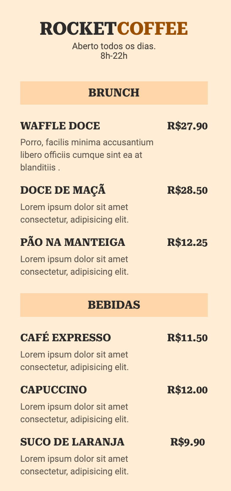

<div align="center">
  <h1>RocketCoffee ☕️</h1>
  <h2>Cardápio digital </h2>
  
</div>

## 📚 Sobre

O projeto foi desenvolvido com o objetivo de praticar as tecnologias html e css. 

A ideia foi fazer um cardápio online de café da manhã, podendo ser acessado via **QRCode.**

## 🚀 Tecnologias utilizadas:

- HTML
- CSS
- Gerador de QRCode

## ⏱️ Como executar

```bash
# Clonar o repositório
$ git clone https://github.com/polyanetuag/rocketCoffee.git

# Entrar na pasta
$ cd rocketCoffee

```

*Obs:* Para a execução, foi utilizada a extensão live server do VsCode

## 📝 Licença

Esse projeto está sob a licença MIT.

---

Desenvolvido com 💜 por Polyane Tuag
